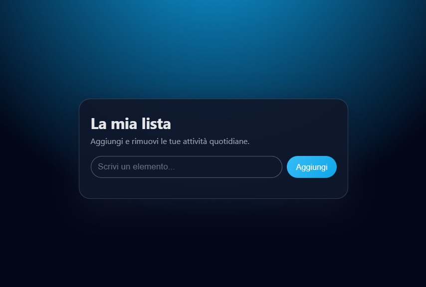

# 📝 Simple To-Do List

A minimal **To-Do List** application built with **HTML**, **CSS**, and **vanilla JavaScript**.  
You can add tasks, mark them as completed with a check button, and delete them with a clean, modern UI.

---

## 🚀 Demo

Open the `index.html` file in your browser to run the app locally.

If you add a screenshot to your repo, you can include it here:

```markdown

